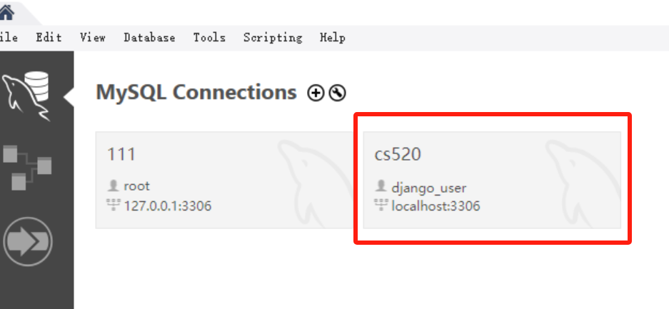

# final-project
 520 Final Project


usage:

# STEP0: (Not required)
```python
# Create correponding user and database in mysql.
# This step is complicated since the created user need all access, feel free to contact me if you need any assistance.

DATABASES = {
    'default': {
        'ENGINE': 'django.db.backends.mysql',
        'NAME': 'cs520_project_user',
        'USER': 'django_user',
        'PASSWORD': 'cs520_project',
        'HOST': 'localhost',
        'PORT': '3306',
    }
}
```
**Your user should looks like this**


```python
# Makemigrations and migrate
python manage.py makemigrations
python manage.py migrate
```

```bash
# run your elasticsearch
.\elasticsearch.bat
pip install -r requirements.txt
```


```bash
# delete elasticsearch database
curl -X GET "http://localhost:9200/_cat/indices?v"

# replace index with index name in elasticsearch
curl -X DELETE "http://localhost:9200/index"

```

# STEP1: run backend server

```bash

python manage.py runserver
```

# STEP2: For Normal User, Open Login URL
```bash
# Open your browser with following link:
http://127.0.0.1:8000/login
# you will also see this url in your backend terminal
```

# STEP3: For Administator, Sign Up A Super Account(Administrator)
```bash
python manage.py createsuperuser
# enter your username, password, email

# A basic Administrator account that can be used (If you don't want to register another)
Username: 23687
Password: 520project
```

# STEP4: For Administator, Open Database Management URL
```bash
# Open your broser with following link:
http://127.0.0.1:8000/admin
# You may manage all accounts
```

# Add Song Source data to database
```bash

# Scraping Song Information from Web Pages, save it to ./utils/songs.json
python ./utils/spider.py

# Add all songs in ./utils/songs.json to database
python ./utils/script.py

```