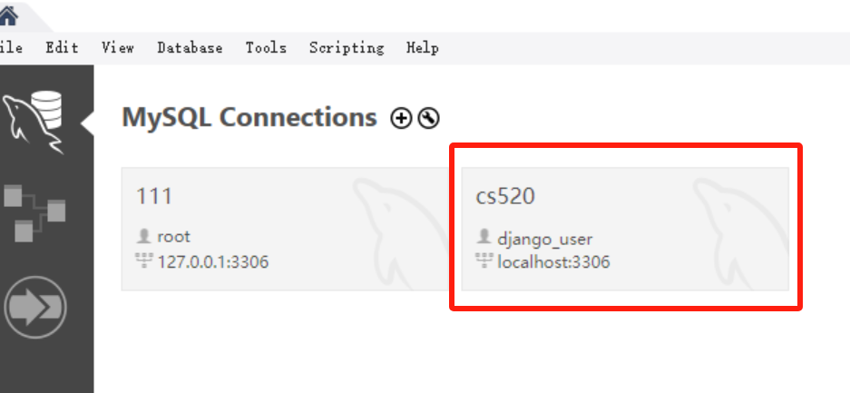
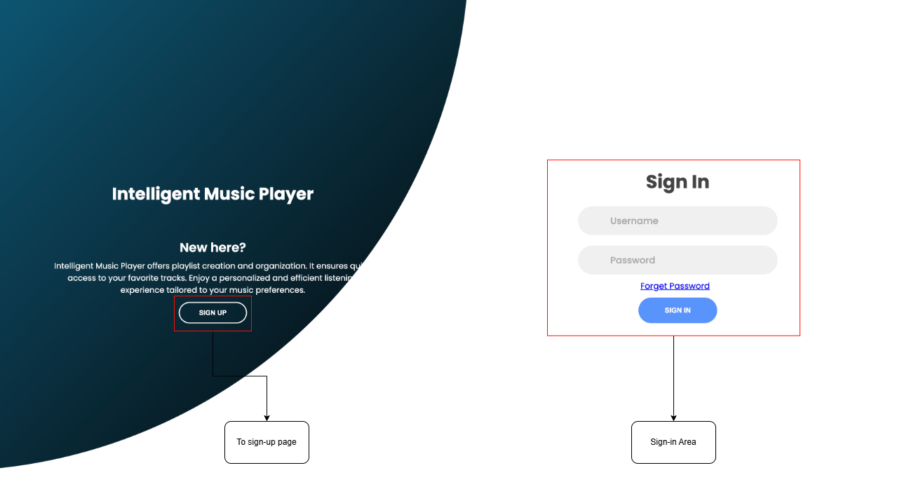
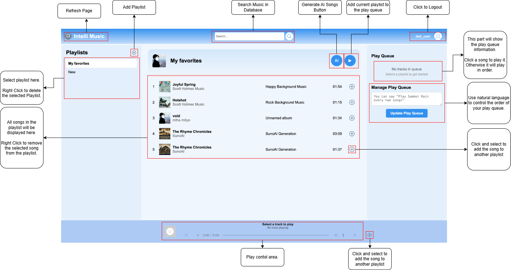
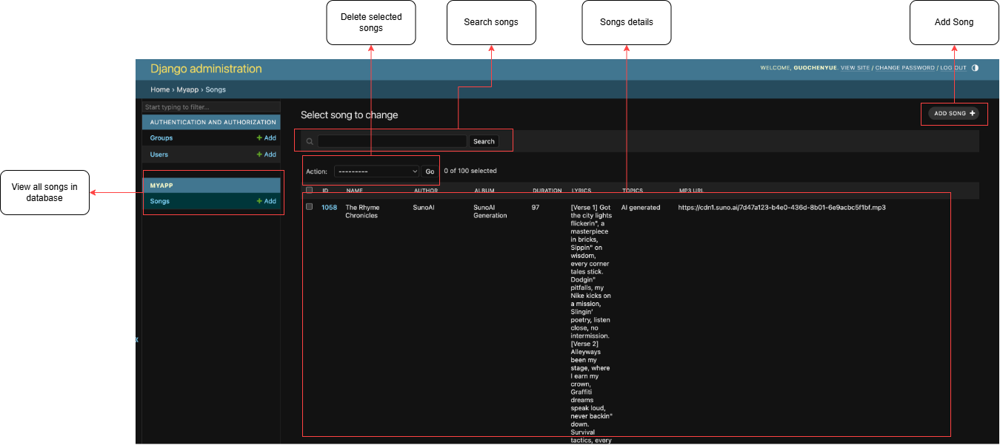

<center>  </center>

# <center>Intelligent Music Player
## Overview
- Most music players offer only basic playlist management, limiting users to simple actions like adding or removing songs. However, as user expectations evolve, there is a growing demand for more intuitive and flexible controls on playlist.  Therefore, we propose our __Intelligent Music Player__ highlighting:
    - A personal music player that leverages large language models (LLMs) for __natural language-guided playlist management__. Users can give complex commands, such as "Play Shooting Star every two songs," and the system will automatically reconstruct the playlist to fit their preferences.
    - Integrating __AI-generated music using Suno__, allowing users to create their own music based on the playlist they created.

- By combining dynamic playlist management and AI-driven music creation, our music player offers a novel and interactive experience, empowering users to personalize and enjoy their music in ways traditional players cannot.

- We have added numerous test cases for both the front-end and back-end. The back-end test coverage has reached 90%. For detailed information about the test cases, please refer to [Test](test.md).

- For the API reference, please refer to [API](api.md).

## Usage:

### Step 0: Configuration
- To run your server in your device, you should install and configure all the requirements below.

#### MySQL Database:
You should have **MySQL** (MYSQL Workbench tool is recommend) correctly installed in your device. And then create **correponding** user and database below in **MySQL**.
```python
DATABASES = {
    "default": {
        "ENGINE": "django.db.backends.mysql",
        "NAME": "cs520_project_user",
        "USER": "django_user",
        "PASSWORD": "cs520_project",
        "HOST": "localhost",
        "PORT": "3306",
    }
}
```

**Your user should looks like this**


- Then perform `makemigrations` and `migrate`
```python
python manage.py makemigrations
python manage.py migrate
```

#### Elasticsearch
To run search engine in this application, you should have **Elasticsearch** correctly installed in your device.
- Insatll [Elasticsearch](https://www.elastic.co/downloads/elasticsearch)

#### Python package requirements
- Install Python 3.10
```bash
pip install -r requirements.txt
```


#### AI Support
To use natural language-guided playlist management and AI music generation, you should configure your API key correctly:
- For OpenAI: Access [Azure OpenAI Service](https://github.com/marketplace/models/azure-openai/gpt-4o) in Github Marketplace to get your OpenAI GPT-4o API key. Then set your environment value `OPENAI_API_KEY` as your API key. You can use commands like:
```bash
# For Linux
export OPENAI_API_KEY=your_api_key_here

# For Windows
setx OPENAI_API_KEY "your_api_key_here"
```

- For SunoAI: Access [AceData](https://platform.acedata.cloud/documents/4da95d9d-7722-4a72-857d-bf6be86036e9) to get your SunoAI API key. Then set your environment value `SUNOAI_TOKEN` as your API key. You can use commands like:
```bash
# For Linux
export SUNOAI_TOKEN=your_api_key_here

# For Windows
setx SUNOAI_TOKEN "your_api_key_here"
```

#### Parse Song Source data to Database
```bash
# Scraping Song Information from Web Pages, save it to ./utils/songs.json
python ./utils/spider.py

# Add all songs in ./utils/songs.json to database
python ./utils/script.py
```

### Step 1: Start Server Backend
- Run your Elasticsearch

- Start your local server:
```bash
python manage.py runserver
```


### Step 2: Create Accounts and Login
- For normal users, open your browser with the url `http://127.0.0.1:8000/login`, you will also see this url in your backend terminal. Then create accounts and login on the webpage.


- For administators, use commands to sign up a super account (Administrator).
```bash
python manage.py createsuperuser
# enter your username, password, email

# A basic Administrator account that can be used (If you don't want to register another)
Username: 23687
Password: 520project
```

### Step 3: Enjoy Intelligent Music Player!
- After logging in, you will enter the music player interface. The following picture demonstrates how you can use our features. Enjoy your musical journey!


### Step 4: Database Management
- If you have logged in as an administrator, open your broser with database management URL:
```bash
http://127.0.0.1:8000/admin
```
- You can manage all accounts, playlists and songs.



### Run Test Cases

```bash
coverage run manage.py test --settings=myproject.settings_test

coverage html
```

### Useful Commands

- Operating Elasticsearch database
```bash
# delete Elasticsearch database:
curl -X GET "http://localhost:9200/_cat/indices?v"

# replace index with index name in elasticsearch
curl -X DELETE "http://localhost:9200/index"
```