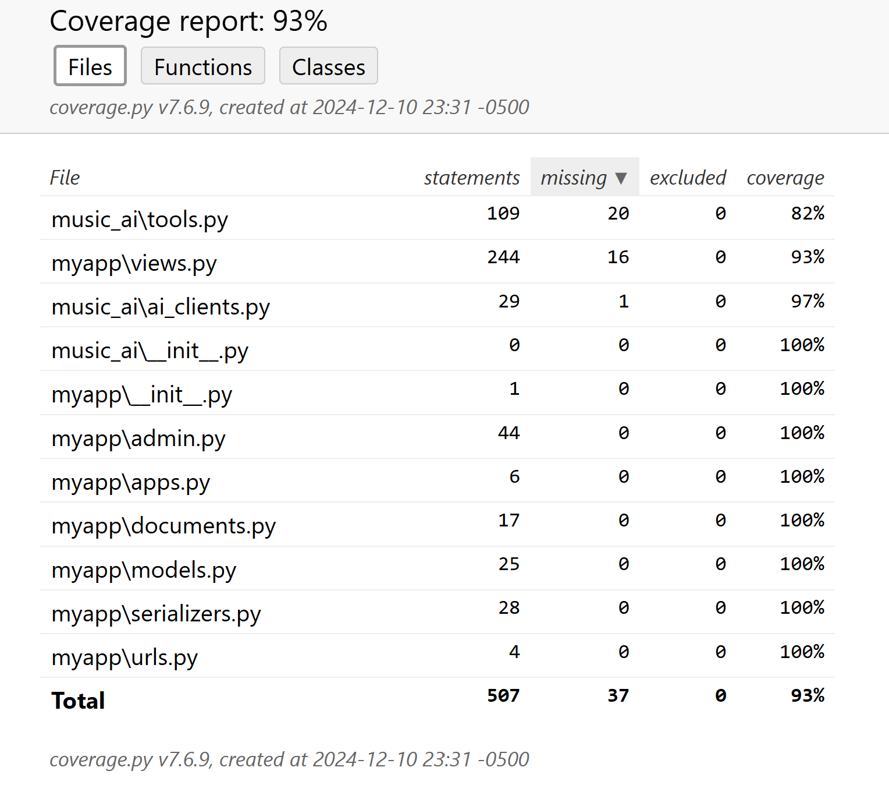

### Front-End Test
| Test Case ID | Test Case Description | Input Description |
|----------|----------|----------|
| TC 101 | Create super user (Admin) | cs520 / cs520 |
| TC 102 | Super user login | cs520 / cs520 |
| TC 103 | Add user (admin) | ljg001 / cs520project |
| TC 104 | Delete user | ljg001 / cs520project |
| TC 105   | Sign up | ljg / ljg |
| TC 105-1 | Sign up (fail for user exists) | ljg |
| TC 105-2 | Sign up (fail for mismatch password) | ljg / ljg / cs520 |
| TC 106   | Reset password | ljg000 / cs520520 |
| TC 106-1 | Reset password (fail for user not exist) | ljg000 |
| TC 106-2 | Reset password (fail for error sec code) | ljg000 |
| TC 107   | Sign in | ljg / ljg |
| TC 201 | Add | playlist |
| TC 202 | Delete | playlist |
| TC 203 | Add | Song to playlist |
| TC 204 | Delete | Song from playlist |
| TC 205 | Search / Add | pop / jazz / ... |
| TC 206 | Refresh | Topleft web name |
| TC 207 | Logout | |
| TC 208~214 | Sign in with a different user accout and show operations above | |
| TC 301 | Add a song to database | test_song |
| TC 302 | Update a song in the database | test_song_updated |
| TC 303 | Search for a song in the database | test_song_updated |
| TC 304 | Delete a song from the database | test_song_updated |
| TC 401 | Select Playlist | |
| TC 402 | Play | |
| TC 403 | Pause | |
| TC 404 | Next/Prev | |
| TC 405 | Change music | Song from playlist and from queue |
| TC 406 | Reorganize song | Pattern/Genre/Shuffle |
| TC 501 | Generate AI music | |
| TC 502 | Add AI music to playlist | |

### Back-End Test
Our backend tests use Django TestCase, achieving 93% code coverage. The detailed coverage report can be found [here](coverage_report/index.html).

